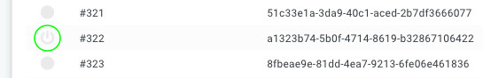

The remote wake up feature allows your to trigger devices to be awoken remotely either from the API or from the cloud frontend.

> Please note that this feature is not available on devices using a Telit modem.

The feature is available in the fleet overview, and can be used by clicking the ON icon to the left of the device.

The functionality is included in the fleet management add-on when using our SIM solution.

:::tip
Contact sales@autopi.io to get more information.
:::