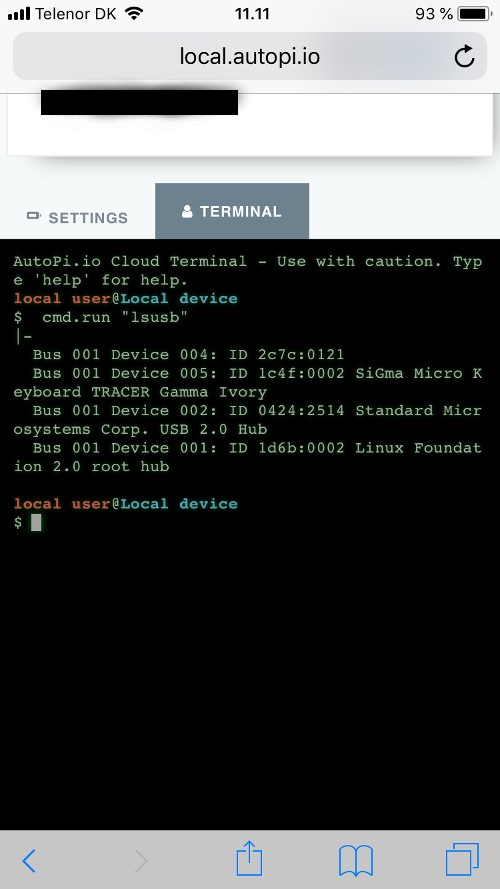
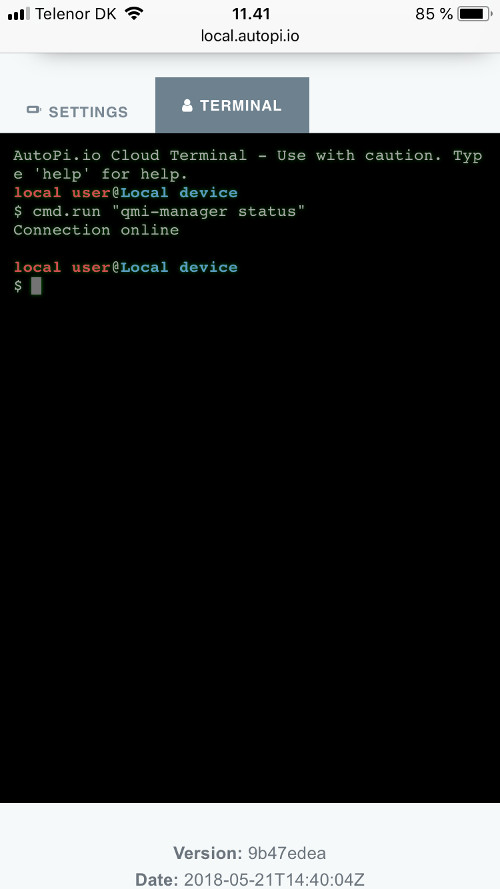

You are experiencing issues connecting to the internet, when connected to the WiFi hotspot on the AutoPi Dongle. 

### Prerequisites:
Before following this guide, you must have completed the initial setup guide found here:

https://www.autopi.io/getting-started

### Check SIM card

1. Your SIM card must be setup for data. To check this, insert the SIM into another device, like a smartphone or similar. When inserted in the other device you must be able to browse the web.

1. If you ordered a branded version of the AutoPi (Verizon/AT&T), please verify that the network carrier of the SIM card is the same as the brand of the AutoPi.

1. Verify that the SIM card is not pin locked and if it is that you have entered the pin code in the settings. 

### Check Modem on Hardware
In the terminal on the WiFi, check that the modem has been found. This can be done by writing the following command:

`cmd.run "lsusb" `

The output of the command should be similar to this:

The important part to look for is the USB device named `"2c7c:0121"`. This is the modem. 

If you ordered a 4G edition and you don't find the modem in your list, then please contact support@autopi.io

### Checking qmi-manager status
The device contains a software manager, which ensure stable connection to the internet. This is called qmi-manager. To check status, please write the following command in the terminal:

`cmd.run "qmi-manager status"`

The output should be similar what you can see in the image below:

### Further checking of network

If your device still isn't online, you can try running the following two commands. They will tell you a bit more about why the network manager fails:

`cmd.run "qmi-manager down"`
`cmd.run "qmi-manager up"`

If the last command reports issue with detecting the SIM card, then double check the orientation of the SIM card and try again.

### Tweaks

If you experience connection issues where the connection drops sometimes and/or if it is online, but not shown as online on my.autopi.io, then you can try to tweak the MTU from the default value: 1500, to a lower value, in increments (ex. 1500 -> 1450 -> etc).
This can be done on the local configuration tool, by connecting to the device hotspot and opening local.autopi.io in your browser.

**NOTE**: For US Verizon customers, please try this MTU: 1428.

If the connection is still not online, then please contact support@autopi.io for additional help.

### Discussion

If you'd like to discuss this topic with us or other fellow community memebers, you can to do on our community page dedicated for this guide:
[4G internet setup troubleshooting](https://community.autopi.io/t/4g-internet-setup-troubleshooting/235)