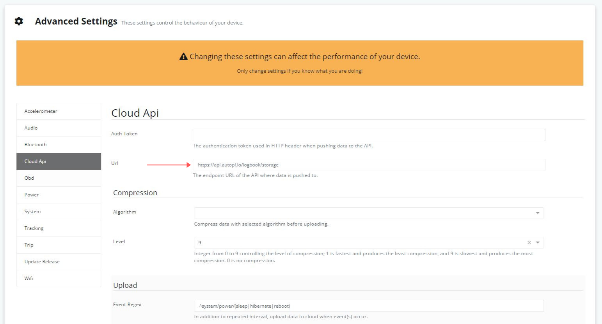

Hey everyone!

Today, in this guide we will explore how you can setup your own server that accepts data from your AutoPi device. We won't get in too many
details, but we will explore the very basics that are needed, namely:

1. How to setup the device to send data to a server different from the default
1. What format of the data to expect from the device
1. Code examples of a very basic REST endpoint (in NodeJS with the ExpressJS framework)

Since we will be building the server with NodeJS, this guide requires you to have a very basic familiarity with Javascript syntax, however it
shouldn't be too hard to follow if you have used other programming languages. Also, you will need to have `node` and `npm` command line tools
installed on your workstation. You can download the full NodeJS package from [here](https://nodejs.org/en/download/).

## Set device's Cloud Api Url
Firstly, we need to make sure that the device will connect to our own server. For this, we do have a very neat option that can
be changed from the [AutoPi Cloud](https://my.autopi.io) website. You need to navigate over to Advanced > Settings > Cloud Api where 
you will be able to see a screen like the following:

 

The Url field on that page points to where the device should send data. By default, obviously, it points to AutoPi's servers. You need to point
instead to a URL that is resolvable from your AutoPi device.

## Device communication
Before we begin building our server, we will talk about the basic structure of the data that AutoPi devices send out. All data is sent in JSON format.
More specifically an array of JSON objects. Let's take a look at an example:

```json
[
    // ...
    {
        "utc": "06:02:24",
        "cog": 140.22,
        "nsat": 9,
        "alt": 34,
        "@ts": "2020-09-03T12:38:24.374314Z",
        "@t": "track.pos",
        "sog": 0,
        "loc": {
            "lat": 57.02241,
            "lon": 9.89919
        }
    },
    // ...
]
```

The most important pieces of information in this are the `@t` and `@ts` fields. They are the type and timestamp fields. Since the rest of the fields will
depend on what type of data is being sent, you are able to decern the rest of the fields in the request.

It is also important to note what the device will do when you send back a response. 2xx response codes like 200 OK will notify the device that the data
has been saved properly and in turn the device will delete the data that was just sent. 4xx and 5xx response codes will let the device know that the
data wasn't correctly saved, so the device will try sending the data again later.

## Let's build a server
As mentioned in the introduction, this guide we will be using NodeJS with the ExpressJS framework. Although we are using NodeJS in this guide,
this is entirely possible to do with any other language that has such capabilities, like Python, .NET, Java and so on.

Before we begin writing any code, we need to bootstrap our work environment. Let's begin by setting up an npm environment:

```
npm init
```

This command will ask you for some details about the new environment that you will be working in. You don't need to be too specific.
After you have initialized your environment, we should install the express framework:

```
npm install --save express
```

:::note
By default with version npm 5.0+ npm install adds the module to the dependencies list in the package.json file; with earlier versions of npm,
you must specify the --save option explicitly. Then, afterwards, running npm install in the app directory will automatically install modules
in the dependencies list.
:::

Now that we have it installed, we can finally start writing code by creating an `index.js` file, or whatever you set the entry point to
be named, in the root directory, or if you'd prefer, create a direcotry where you will keep your source code and create it there.

Firstly we start off by creating an express application:

```javascript
// index.js

const express = require('express');
const app = express();
```

The express application constant will be used to setup the configuration for our API routes. We can use the `get`, `post`, `put` and `delete`
methods of the `app` constant to build up the routes which will be available for our application. Let's take a look:

```javascript
// index.js

app.get('/', (req, res) => {
    res.send('Hello world!');
});
```

The above example simply allows clients to make a `GET` request to your server and will respond with a 'Hello world!' message. Express
automatically sets the response code to 200 OK with the `send` method unless specified otherwise. Now that we have our first API endpoint
specified, it is time that we started the server up:

```javascript
// index.js

const port = 8000;
app.listen(port, () => {
    console.log(`Example express application listening on port ${port}`);
});
```

With this, we are ready to test out our application. Run `node index.js` in your command line and after you see the console message appear,
navigate your browser to `localhost:8000`. You should be able to see the 'Hello world!' message appear on your screen.

Let's now work with a little bit more complex example. Let's imagine your device will be sending you data. This data will be send through `POST`
requests, which means that we will need to chnage the method which the server recognizes and extract the data from the request body.
Since the device will send data over in JSON format, you will also need to use a body parsing middleware such as
[`express.json()`](https://expressjs.com/en/4x/api.html#express.json). Make sure to add the new code before you call the `listen`
method on your express application.

```javascript
// index.js

const express = require('express');
const app = require('app');

app.use(express.json());

app.post('/', (req, res) => {
    // this is the data that was sent by the device
    const data = req.body;

    // work with data in some way
    console.log(data);

    res.response(200).end();
});

app.listen(/* ... */);
```

## Authentication
Of course, it would be nice if there is some type of authentication happening, instead of letting everyone send data over to your server.
You can do that by adding a middleware function that will authenticate based on the token that is being sent by the device. You can find the token
your device uses by navigating over to [AutoPi Cloud](https://my.autopi.io) > Advanced > Settings > Cloud Api. One of the first fields there should be the
Auth Token field. The token will be sent in the `Authorization` HTTP header in the following format:

```
Authorization: Bearer AUTH_TOKEN
```

Now that we know what the token is, we can write a middleware function that we can later use to authorize client requests. We can get the `Authorization`
header's data by using the [`req.get()`](https://expressjs.com/en/4x/api.html#req.get) method inside the middleware:

```javascript
// authenticate.js

module.exports = function authenticate(req, res, next) {
    const authorizedToken = "SOME TOKEN PASTED IN HERE OR SOMEWHERE ELSE";
    const token = req.get('Authorization');
    
    if token !== `Bearer ${authorizedToken}` {
        // token is invalid, bail out
        res.status(401).end();
        return
    }

    // token is valid, call next middleware function
    next();
}
```

One thing that we can notice in this function is that it accepts the same arguments as the function that we created for the router, `req` and `res`. Those are
the same request and response objects that are passed on all middleware functions with data for the specific request that is being processed at the time. The
`next` parameter is an extra parameter that is also passed to each middleware function. Its function is to pass on the flow to the next middleware function.
If the `next` function is called, the next middleware function will be called, if it isn't the flow will stop at the current middleware function.

After implementing `authenticate`, you can attach it to the already existing router:

```javascript
// index.js

const express = require('express');
const app = require('app');

// import the authenticate function
const authenticate = require('./authenticate.js');

app.use(express.json());

// add it as an argument to the post method, right before the actual receiver of the data
app.post('/', authenticate, (req, res) => {
    const data = req.body;
    // work with data in some way
    res.response(200).end();
});

app.listen(/* ... */);
```

## Final thoughts
It should be fairly simple to get a server up and running to accept data from any AutoPi device. This guide went into brief details on how to implement such a
server in NodeJS, however implementing a REST API server is very simple with any other modern programming language. As usual, if you have any questions in regards
to this, feel free to contact our support team on support@autopi.io and they will be more than happy to give you guidance.