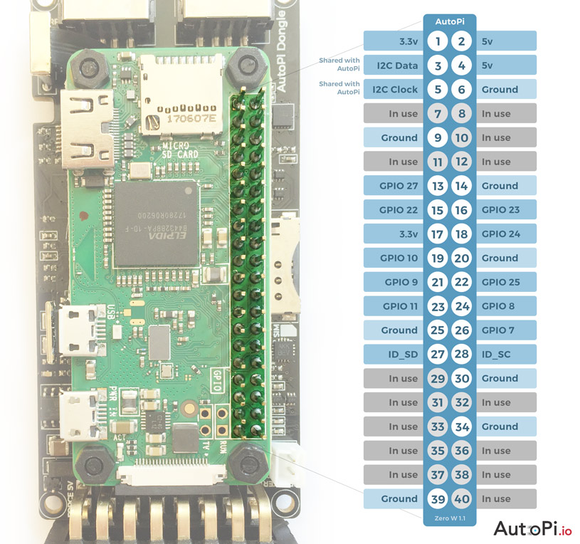
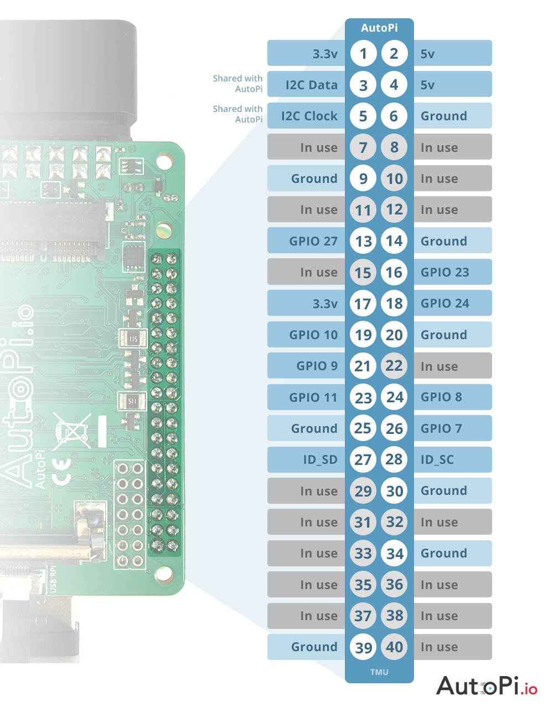

This image is an overview of the GPIO pinout of the AutoPi. 

Pins marked with "in use" cannot be used for anything else. This will interrupt the functionality of the AutoPi. This I2C bus is used by the AutoPi, but can be shared with other devices. 

All other pins are free and their functionality follows that of the Raspberry Pi.

### Discussion

If you'd like to discuss this topic with us or other fellow community memebers, you can do so on our community page dedicated for this guide:
[AutoPi GPIO Pinout](https://community.autopi.io/t/autopi-gpio-pinout/271)