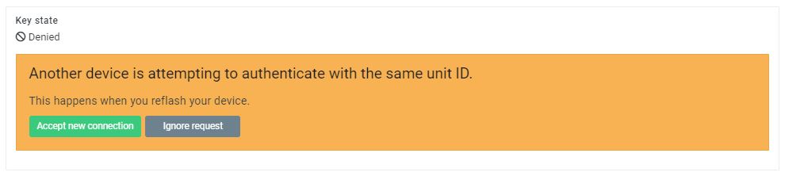

Hello everyone!

In this short guide we will talk about how you can move your device from the default production
environment to your private environment provided by AutoPi. Unfortunately, this process moves
only one device at a time, so you will need to repeat the steps for each device you need to move.

Essentially, what we will be doing is to change the url of the `/boot/host.aliases` file to
point to your private environment. Firstly, we need to change the master URL to point to your
private server, in this example it is `private.autopi.io`.

```bash
# if running the command directly on the device (e.g. SSH)
$ echo "hub private.autopi.io" > "/boot/host.aliases"

# if running the command through a web terminal
$ cmd.shell 'echo "hub private.autopi.io" > "/boot/host.aliases"'
```

Next, we need to make sure that the master is specified correctly in the salt-minion configuration
file:

```bash
# if running the command directly on the device (e.g. SSH)
$ autopi minionutil.change_master hub confirm=True

# if running the command through a web terminal
$ minionutil.change_master hub confirm=True
```

The above command will ensure the salt-minion configuration is set correctly and also restart
the salt-minion.

Lastly, we need to accept the new device's keys. You can do that by logging in to your private
webpage (https://private.autopi.io/account/devices) and registering your device if it isn't
already.

Once you have it registered and you have brought the device online, accept the key.



When that is done, you'll need to restart the salt-minion once more. You can do that by issuing
the following command:

```bash
# if running the command directly on the device (e.g. SSH)
$ sudo systemctl restart salt-minion

# if running the command through a web terminal
$ minionutil.restart
```

And that's it. Your device should now be connecting directly to your private environment and
you should be able to make configuration changes, execute commands and so on. If you experience
any issues with the process, please send a mail to our support team over at support@autopi.io.