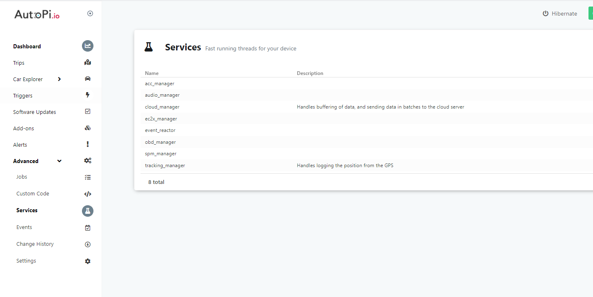
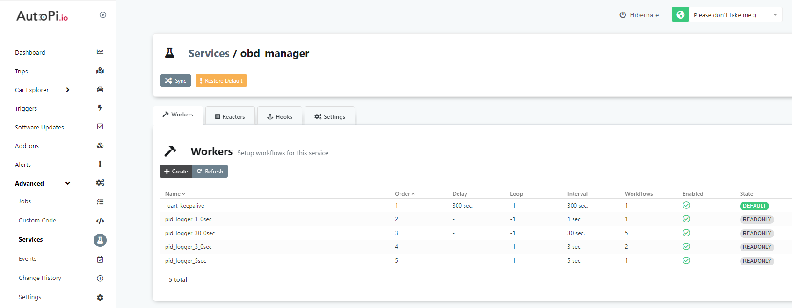
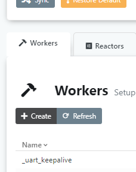
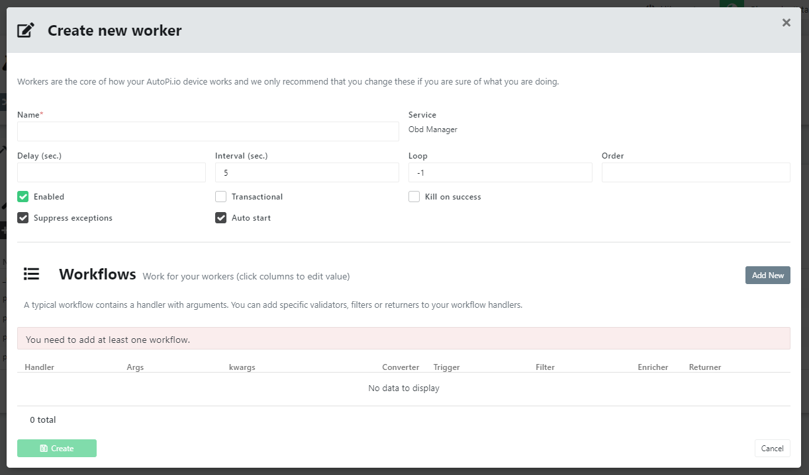
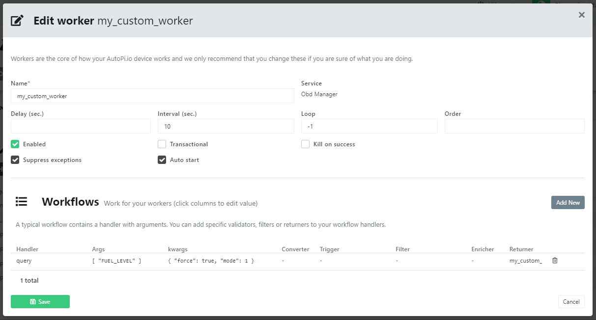

In this guide we are going to take a look at how to create workers for any service that is available, be it a default service like the OBD manager or a custom one that you've made for yourselves. First off we're going to explore what can workers be used for and later on in the guide we're going to go through creating an example worker that is going to fetch OBD data and save that data to a file. Let's get started!

## Services (also called managers)
To understand workers, one first needs to understand what services are. Services are basically a separate, child process that is running in the background that is managed by a parent process (more specifically, the salt minion). If that process fails, salt will make sure that it is started up again and the error is reported as needed. 

More importantly however, the default services that come with an AutoPi are the preferred point of communication between the Core software and their hardware counterpart. For example the OBD manager is responsible of communicating directly with the STN chip to get communications with a vehicle working. This makes services a very convenient place for operations that are closely related to specific parts of an AutoPi device.

 

## Workers
Now, the real deal - workers. Workers are simply a process that is going to be executed by a manager in a specific [workflow](http://docs.autopi.io/services/) that is going to eventually yield a desired output. Workflows are a number of steps that are going to be executed in order to create that desired output:

 

### Let's create a worker
First off, you'll need to decide which manager to use. That really depends on the use case you have. For example, if you would like to read OBD data, the obd_manager would make the most sense. If on the other hand you would like to execute some AT command that isn't implemented by default, the ec2x_manager is the one you'd be looking at.

For the purposes of this guide, we will create a worker inside the obd_manager that will be fetching some data. We will navigate to the services page (Advanced > Services) and select the obd_manager entry on the screen.

The new page that opens up is the home page for the obd_manager where all of its workers reside. We will create a new worker now. Click on the '+ Create' button to open up the creation window.

 

You'll be presented with the following window:

 

Let's now get familiar with the interface. There are a few fields that need filling out and then we will move on to the workflows:

1. **Name**: The name of the worker. This is just for recognizability of the worker.

2. **Delay**: This is the delay before the initial start of execution of the worker. This means that the worker will wait *X* amount of seconds before initiating the first loop.

3. **Interval**: This is the interval between each loop of the worker. As we'll see below, you are able to set the worker to execute multiple times (which is why they're so useful). The interval will be the time that it takes between each execution.

4. **Loop**: This is the amount of times the worker will execute within a power cycle of the AutoPi device. You can set this to the following values:

    1. *less than 0*: The worker will loop forever and execute the workflow every time
    2. *0*: The worker won't work. This is the equivalent of disabling the worker.
    3. *more than 0*: The worker will loop the amount of times specified and then stop. This can be used if you want the worker to do a specified amount of work and then stop working.

5. **Order**: This is the order that the workers are going to be executed in. This is a more 'global' field, meaning that it will affect the execution of the rest of the workers in this service as well. The lowest ordered worker will execute first and then go up from there.

### Workflows
Now that we've gone through the basic options, let's take a look at the possibilities for workflows. Creating a workflow adds a new row on the table below. This is the basic representation of a workflow. The columns in the table are as follows:

1. **Handler** - handlers are the first step in the workflow. They will communicate with the device's hardware and produce the initial output.

2. **args** - the arguments that are to be passed to the handler.

3. **kwargs** - the key word arguments that are to be passed to the handler.

4. **Converter** - they transform the data to another, usually more usable, form.

5. **Trigger** - this is usually the code that decides whether to do something based on the result of the handler, for example, [making a beep sound from the device](https://community.autopi.io/t/custom-code-write-custom-trigger-to-play-beep-sound-when-speeding/1566).

6. **Filter** - filters are responsible for deciding whether the data that is currently being manipulated is significant or not. They can stop the flow of execution if they return something that is considered [falsy](https://stackoverflow.com/questions/39983695/what-is-truthy-and-falsy-how-is-it-different-from-true-and-false) - for example a value of `False`, `None`, an empty string, and so on. 

7. **Enricher** - enrichers.. well.. enrich the data. They add additional data, possibly by computing the result.

8. **Returner** - returners are responsible for returning the result somewhere. For example, [saving the result on a file](https://community.autopi.io/t/custom-code-redirect-logged-data-and-store-it-in-a-file-or-anywhere/1521) or sending it over the internet to some cloud solution. A prime example for a returner is the cloud returner that is responsible for saving the data on my.autopi.io

All of the above (except for args and kwargs) are also called *hooks*. We will look into them in the next section.

Different services have different defaults handlers. The best place to take a look at those handlers is [our documentation website](http://docs.autopi.io/services/). Since the idea we're going for in this guide is to invoke continuous OBD query commands, we're going to be using the [query](http://docs.autopi.io/services/obd_manager/#query) handler.

The arguments (args) and key-word arguments (kwargs) are specified in JSON format (this means double quotes instead of single quotes, it took me a while to figure that out the other day). We want to read out the fuel level every 10 seconds and record that data, so we will specify the following arguments:
```json
[ "FUEL_LEVEL" ]
```

The key-word arguments aren't essential for the worker to work, however they give more control over how it'll operate, so we'll specify the following kwargs:
```json
{
    "mode": 1,
    "force": true
}
```

Now we've got the first part of a workflow going. From here on out, everything else is optional depending on your needs. Most of you would want to have some way of saving the data however, for which you can use a returner. You can view a guide about that [here](https://community.autopi.io/t/custom-code-redirect-logged-data-and-store-it-in-a-file-or-anywhere/1521). Here's the final result:



The last thing you need to do is to hit Save and let the device sync up with the new changes. After a service restart, the device should be executing your new service worker.

### Hooks
You can create your own custom hooks by creating a new custom module (Advanced > Custom Code) with an execution type, but you have to register them to each individual service through the Hooks tab. Each hook needs to have this specific signature:

```python
def some_function_name(result):
    # work with result and return some manipulated value
    return value
```

The important part is that the function receives some result and returns some value. Based on the output of each hook the workflow might be interrupted. If falsy values are returned at a specific point in the workflow, the rest of the workflow will stop. **This isn't the case** with triggers - they will always execute, as the logic there might be very valuable to be executed even if there is an interruption. Even in the case of a thrown exception the trigger will still execute.

### Troubleshooting your service

#### My service doesn't start / I dont see any logs from my service
1. Check that the service is enabled in the cloud, and check that it is part of the engines file in /etc/salt/minion.d/engines.conf
2. Check that the associated custom module has valid code
3. Turn on debug logging on the device (In advanced settings), and restart the salt-minion, and then look for errors.
you can use the following command to grep for the specific service

```
sudo tail -f /var/log/salt/minion | grep service_name
```

## Conclusion
As a closer - workers are extremely powerful if used correctly. They can execute continuously or a set amount of times. Workflows within the worker can be set up so that the desired outcome is reached without having to write complicated custom code. Use them to your advantage whenever you want to communicate something with the hardware components of the AutoPi or with your car directly.