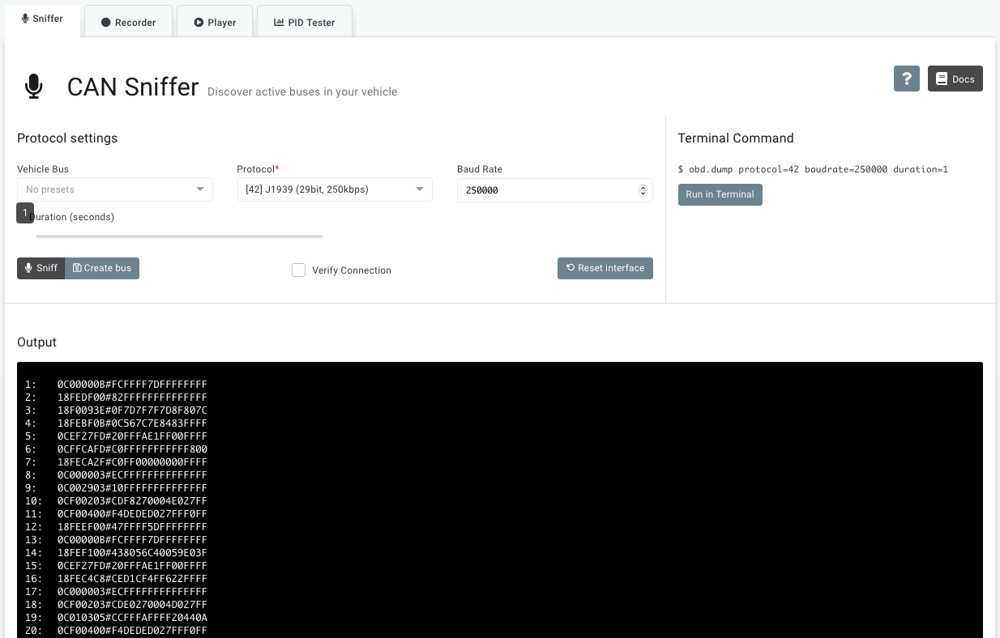
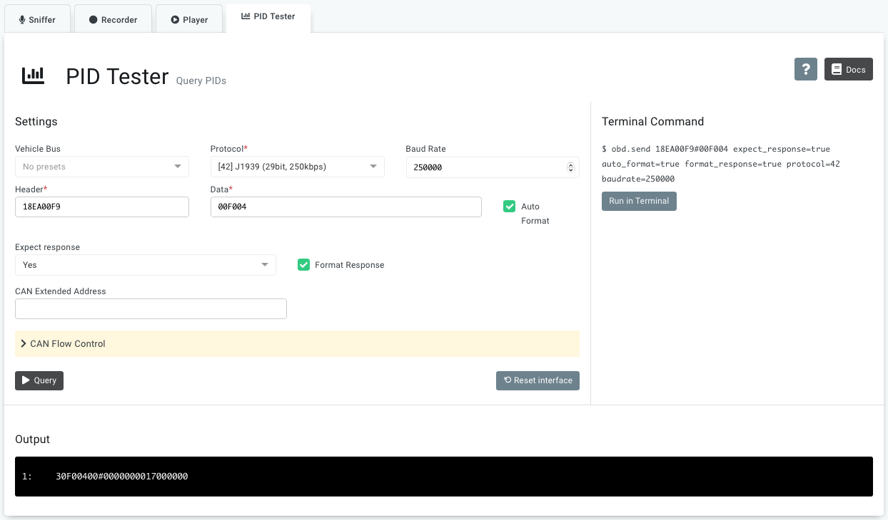
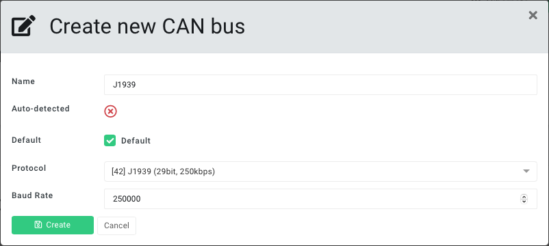
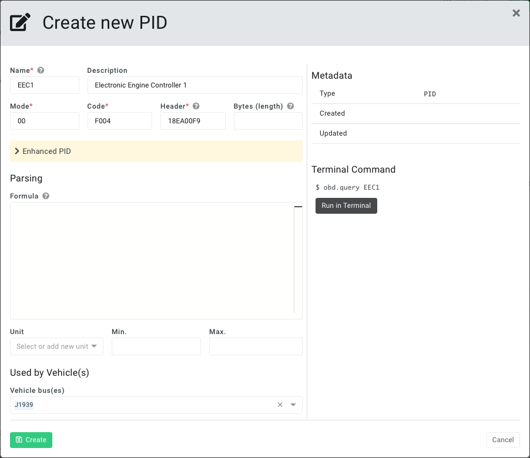
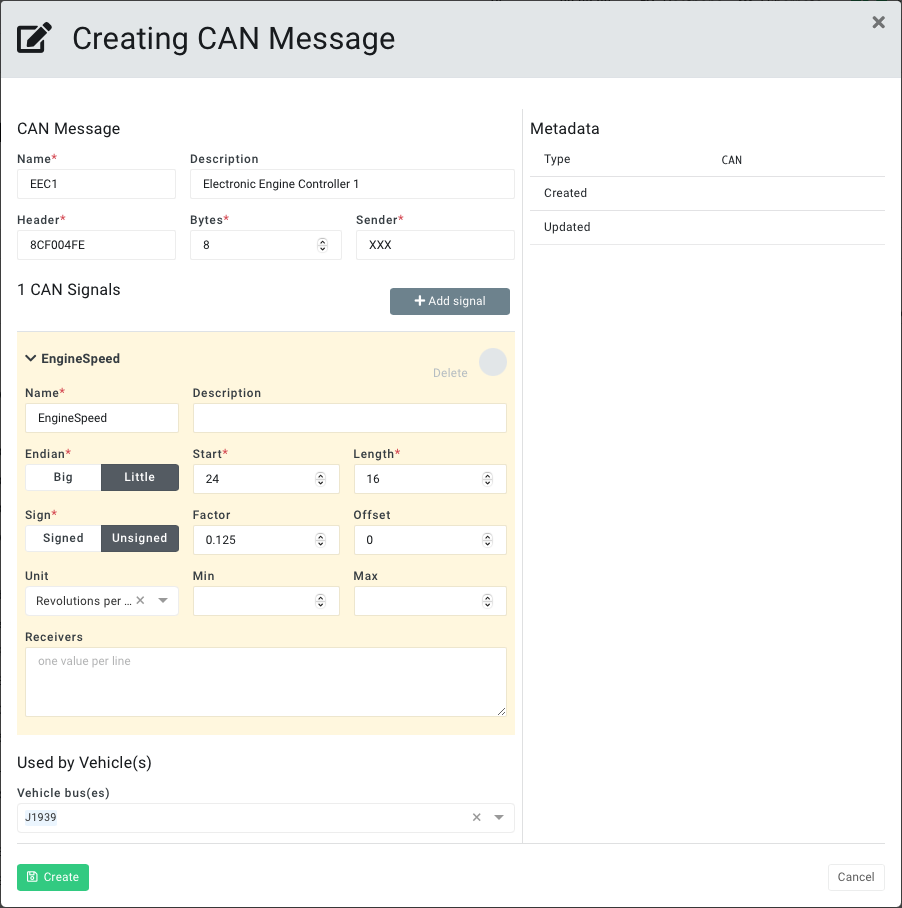
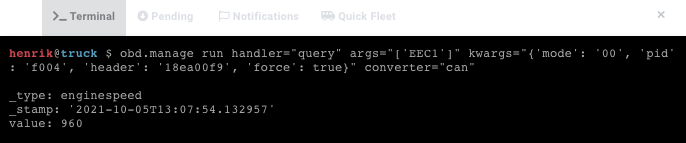

This guide will show how to retrieve data from a vehicle supporting the J1939 protocol. To read more background information about J1939 please see the blog post: [J1939 Explained](https://www.autopi.io/blog/j1939-explained/)


## Preconditions
Before proceeding the AutoPi device must be:

  1. Connected to the vehicle with an appropiate OBD-II adapter cable that connects the vehicles two J1939 CAN bus wires to pin 6 (high) and 14 (low) of the OBD-II connector on the AutoPi device. If you are missing an adapter cable for your specific vehicle please contact sales@autopi.io.
  2. When initially inserting the device, make sure that the vehicle is powered off.
  3. Powered on and online in the AutoPi Cloud at https://my.autopi.io.
  4. Also the ignition of the vehicle must be turned on to ensure the J1939 CAN bus is active.


## Check for Broadcast Data
As most J1939 messages are broadcast we start by checking if we can see any data on the CAN bus.

On https://my.autopi.io go to _Car Explorer_ > _CAN Analyzer_ > _Sniffer_.

Select one of the following J1939 protocols that fits your vehicle in regards to 11bit or 29bit header:
  - `[41] J1939 (11bit, 250kbps)`
  - `[42] J1939 (29bit, 250kbps)`

**Optional:** Change the baud rate if predefined value of `250000` is incorrect. `500000` is a typical alternative.

Click the _Sniff_ button to start recording CAN messages sent on the J1939 bus. An example of a recording result is shown in below screenshot.

:::note
The start and end of the recording are indicated audibly with loud beep sounds played by the AutoPi device.
:::

_Example_:



If no data is returned, try:
  1. Change the protocol and/or baud rate combinations.
  2. Increase the recording duration from default `1` to `10` seconds.
  3. Continue to the next section describing how to query for data.


## Query for Data
Some data is only available on request. This means a J1939 request message must be sent in order to get a data response. This can be done using the PID tester tool.

In the _CAN Analyzer_ select the _PID Tester_ tab.

First the J1939 protocol and baud rate must be specified in the same way as described previously.

Next the J1939 request message must be specififed. It consists of a header and a data part. 

>**Header:** `18 EA 00 F9` is broken down into:
>
>  - `18` contains priority of 6.
>  - `EA 00` is PGN 59904 (Request PGN).
>  - `F9` is source address 249 (Service Tool).
>
>**Data:** `00 C1 00` is the specific PGN that is requested. In this example PGN 49408 (Diagnostic Readiness 2).

_Example_:

 

In above screenshot we query PGN 61444 (Electronic Engine Controller 1) which among other values contains SPN 190 (Engine Speed).


## Register Vehicle Bus
Once a J1939 bus has been identified and tested, it is recommended to register it on the vehicle's profile.

Go to _Account_ > _Vehicles_ and click on _Create_ button below _CAN Buses_. Fill in the relevant values for name, protocol and baud rate.

_Example_:




## Register PID for Request PGN
This section may be skipped if you only receive broadcast J1939 messages. But if you need to query for a specific PGN it is recommended to register the request PGN as a PID in the _Car Explorer_ library. It can then later be used to easily set up loggers.

Go to _Car Explorer_ > _Library_ > _Create_ > _PID_.

Enter the informations previously verified using the _PID Tester_.

_Example_:



#### PID Details

>**Name:** Short name of the PGN requested.
>
>**Description:** Optional description of the PGN requested.
>
>**Mode:** Hexadecimal value `00` is specified here.
>
>**Code:** The hexadecimal representation of the requsted PGN number 61444 (Electronic Engine Controller 1).
>
>**Header:** The header to request a PGN:
>
>  - `18` contains priority of 6.
>  - `EA 00` is PGN 59904 (Request PGN).
>  - `F9` is source address 249 (Service Tool).
>

:::note
It is recommended to specify how many messages/frames are expected to be returned by the query. This is done by unfolding the section _Enhanced PID_ and entering the number of messages under _Frames_. This helps reduce the total query time (better performance) because the waiting timeout for the last message is skipped.
:::

#### Used by Vehicle(s)

>**Vehicle Bus(es):**  Specify which bus(es) the PID is to be associated with. The previously created J1939 bus is selected.


## Decode Messages (with DBC file)
After receiving the raw J1939 CAN messages they must be decoded to get the actual measurement values. This can be done using the built-in CAN database functionality.

The CAN database contains definitions of how the individual CAN messages are structured. Each CAN message can consist of one or more CAN signals, each of which typically contains a single measurement value (eg. temperature, speed, RPM or the like).

As an exmaple, the J1939 PGN 61444 (Electronic Engine Controller 1) contains 8 SPNs in total. It can be mapped to a CAN message with 8 CAN signals as shown below.

```
PGN 61444 (Electronic Engine Controller 1)                            --->  CAN message
  SPN 899 (Engine Torque Mode)                                        --->    CAN signal #1
  SPN 899 (Engine Torque Mode)                                        --->    CAN signal #2
  SPN 4154 (Actual Engine - Percent Torque)                           --->    CAN signal #3
  SPN 512 (Driver's Demand Engine - Percent Torque)                   --->    CAN signal #4
  SPN 513 (Actual Engine - Percent Torque)                            --->    CAN signal #5
  SPN 190 (Engine Speed)                                              --->    CAN signal #6
  SPN 1483 (Source Address of Controlling Device for Engine Control)  --->    CAN signal #7
  SPN 1675 (Engine Starter Mode)                                      --->    CAN signal #8
  SPN 2432 (Engine Demand – Percent Torque)                           --->    CAN signal #9
```

When all (or only a few selected) CAN messages have be defined they will need to be synchronized to the AutoPi device and stored in the form of a DBC file. The synchronization is handled automatically by to AutoPi Cloud management system. Using this DBC file, the AutoPi device can decode raw CAN messages into readable measurement values. The decoded data can then be uploaded to the AutoPi Cloud, stored locally or sent to any custom endpoint.

### Create Mapping 

To create a mapping for a CAN message to be be decoded go to _Car Explorer_ > _Library_ > _Create_ > _CAN_.

_Example_:

 

In above screenshot, we register a CAN message mapping for PGN 61444 (Electronic Engine Controller 1):


#### CAN Message

>**Name:** Short name to identify the CAN message.
>
>**Description:** Optional description of the CAN message.
>
>**Header:** CAN message header for PGN 61444:
>
>  - `8C` contains priority of 6 but has no actual significance.
>  - `F004` is the hexadecimal representation of PGN number 61444.
>  - `FE` is source address 254 (Null Address) but has no actual significance.
>
>**Bytes:** 8 is the number of data bytes that the CAN message contains.
>
>**Sender:** Identifier of the ECU that sent the CAN message. Enter `XXX` or similar if unknown.


#### CAN Signal #1

In the above screenshot we only show how to map SPN 190 (Engine Speed) but the procedure the same when adding more.

>**Name:** Short name to identify the CAN signal.
>
>**Description:** Optional description of the CAN signal.
>
>**Endian:** Sequence of bytes is little-endian - least significant bits first.
>
>**Start:** Bitwise start index of the CAN signal value within the data part of the CAN message. When it comes to big-endian indexing is straightforward, but for little-endian it is more complex.
>
>**Length:** Bit length of the CAN signal value.
>
>**Sign:** Unsigned integer value - no negative values.
>
>**Factor:** A factor of `0.125` to be multiplied by the value in order to get the actual measurement value.
>
>**Offset:** No offset to be added to the value.
>
>**Unit:** Unit of the value is RPM (Revolutions per minute).
>
>**Min:** The maximum possible value is undefined.
>
>**Max:** The minimum possible value is undefined.
>
>**Receivers:** Identifiers for ECUs that use the signal value.


#### Used by Vehicle(s)

>**Vehicle Bus(es):**  Specify which bus(es) the CAN message is to be associated with. The previously created J1939 bus is selected.


### Sync DBC File

After the CAN message has been created, it must be synchronized to the AutoPi device. This is done in the same way as all other changes; applied immediately on request if the device is online or queued and applied the next time the device is back online.

When synchronizing, the CAN messages are stored in one or more DBC files located on the file system below the path:

```
/opt/autopi/obd/can/db/protocol_<ID>.dbc
```

A separate DBC file is created on the device for each associated vehicle bus protocol. 
In the above example, protocol `[42] J1939 (29bit, 250kbps)` is used. Therefore, the synchronized DBC file will be found at: `/opt/autopi/obd/can/db/protocol_42.dbc`

:::note
As default, all created CAN messages and associated CAN signals are synchronized to the DBC file. But if one or more CAN signals are used in loggers (_Car Explorer_ > _Library_) only the used CAN signals and CAN messages are included in the DBC file.
:::


### Test CAN Converter

To easily test CAN message conversion with a DBC file, the following terminal command can be executed. It performs a single workflow that queries a PGN and then converts the raw response message using the DBC file.

```
obd.manage run handler="query" args="['EEC1']" kwargs="{'mode': '00', 'pid': 'F004', 'header': '18EA00F9', 'force': true}" converter="can"
```

_Example_:



#### Command Breakdown

>_**obd.manage**_ is the [command](/core/commands/core-commands-obd/#obdmanage) to execute.
>
>_**run**_ a [workflow](/core/services/core-services-intro/#workflows) directly.
>
>_**handler="query"**_ specifies the handler of the workflow to be called.
>
>_**args="['EEC1']"**_ specifices the arguments of the handler. The value consists of an embedded JSON array.
>
>_**kwargs="{'mode': '00', 'pid': 'F004', 'header': '18EA00F9', 'force': true}"**_ specifices the keyword arguments of the handler. The value consists of an embedded JSON dictionary.
>
>_**converter="can"**_ specifies a converter in the workflow to be called after the handler. Here we use the [CAN](/core/services/core-services-obd-manager/#can) converter.

## Setup Loggers

To receive the J1939 data in the cloud, loggers must first be set up on the device. Go to _Car Explorer_ > _Loggers_ and create loggers for the respective PIDs and or CAN messages. After a logger has been created, it must be synchronized to the AutoPi device, just like any other change.
