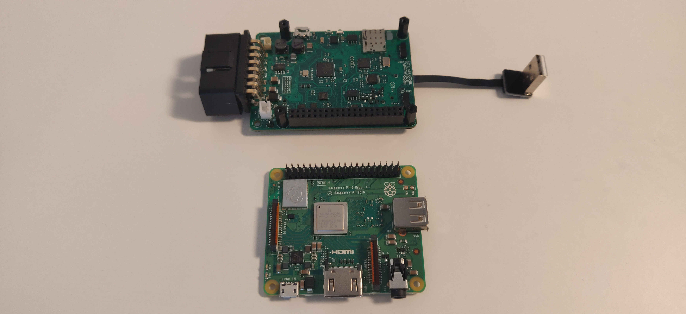
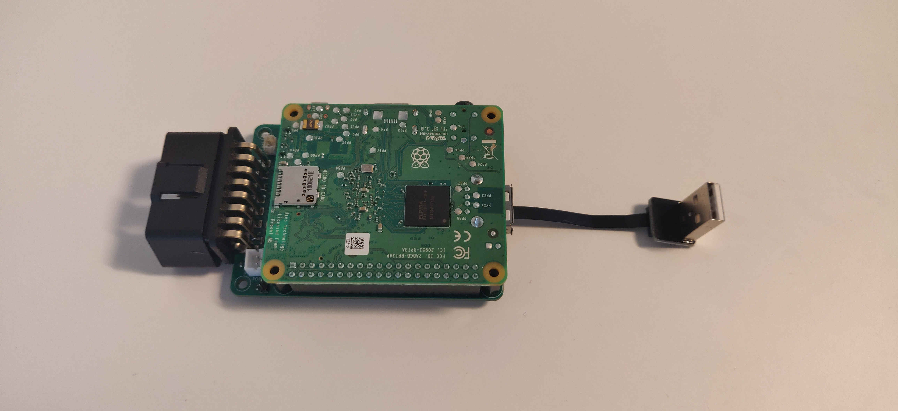
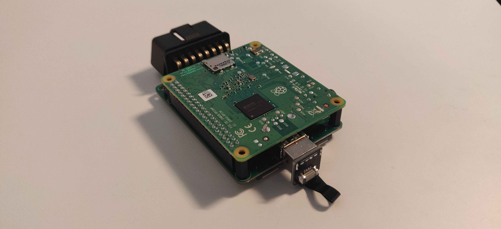
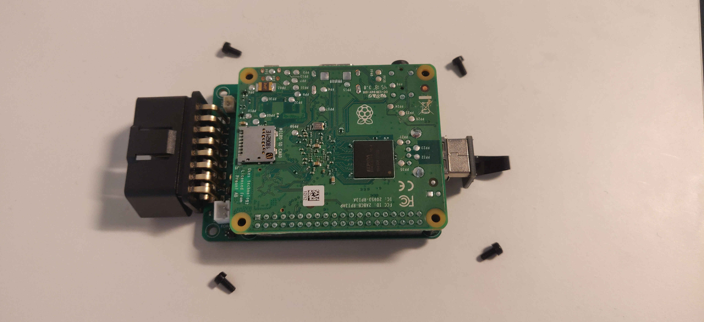

Congratulations on your AutoPi Dongle, DiY Edition! We're sure that you have some great plans on how to use
the device to your liking, but of course, first, you need to set it up. This is a guide that shows the
steps that need to be taken to get the device in running condition.

### Connecting the Raspberry Pi
The steps you need to take are very simple. In this case, we are using a Raspberry Pi 3 A+,
however this can work with a Raspberry Pi 3 B+ or a Raspberry Pi 4.

1. Mount the Raspberry Pi on the AutoPi, connecting the pins of the Raspberry to the open holes in the
AutoPi board.

2. Connect the USB cable that's attached to the AutoPi board to one of the open USB ports of your Raspberry Pi

3. Lastly, place the four screws to secure the two boards fastly together.

### Connecting to the Cloud
Should you want to use the AutoPi Cloud solution, you can use the image found in [this](https://github.com/autopi-io/autopi-core/releases) link to flash an SD card. Make sure to download the correct image for
your device - since you're reading this guide, you are most likely to be needing to download the
TMU image, instead of the GEN 2 image.

*TIP: Etcher can write the compressed image directly to the SD card. We recommend using a Class 10 SD card
with a minimum of 8GB storage.*

### Logging in to the device
The device is initially configured with the following credentials:

*WiFi*  
SSID: AutoPi-Initial  
Password: autopi2018

*SSH*  
User: pi  
Password: autopi2018

**We highly recommend that you chnage those settings as soon as you are able to do so.**

### Getting access to the Cloud
To get your device on the AutoPi Cloud you need to get the unit ID of your device. You can find out
your device's ID by reading out the `/etc/salt/minion_id` file. Once you have that ID, you should write to
our support team (support@autopi.io) asking for it to be added to the system. Make sure that the dongle has
been online at least once before doing this.

**Please note**: The AutoPi *always* needs to be powered through the OBD connector to function properly.
Powering the board through the micro usb (or usb-c for RPi 4) power plug on the Raspberry Pi could damage your
board. If you need to test the AutoPi in a lab environment, we encourage you to get the [OBD power connector](https://shop.autopi.io/en/products/obd-ii-power-cable-10/) from our shop.