This is a step-by-step guide on how to access the HDMI on your dongle. 

This guide does require that you have a little bit of DIY abilities/skills, but you can still manage it even if you are not DIY savvy. 

1. First, you need to make sure you have the following; your dongle separated, a knife, and a lighter.

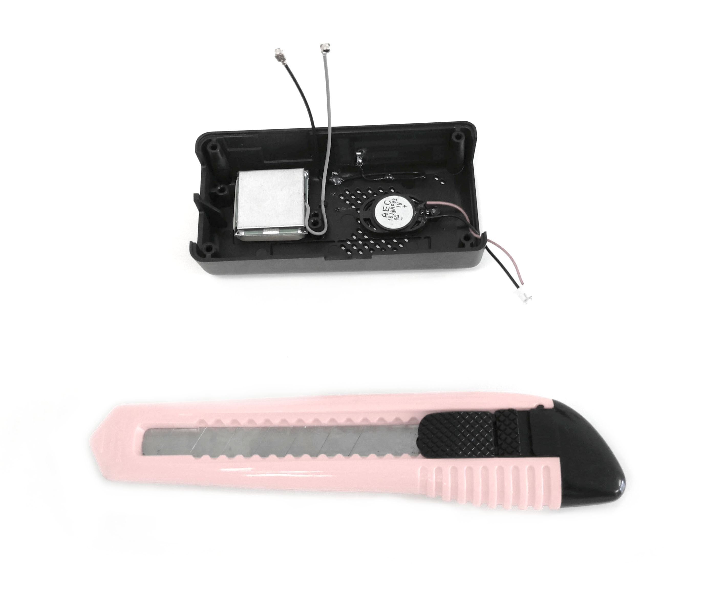

2. The first step is you need a sharp knife, we recommend a hobby/pocket knife; then use the lighter. 

3. Place the knife above the flame and slowly heat up the knife, so it can cut through the device easier. 

4. Once you have the dongle separated, inside the top casing, you’ll be able to see the subtle markings of where to cut.
 
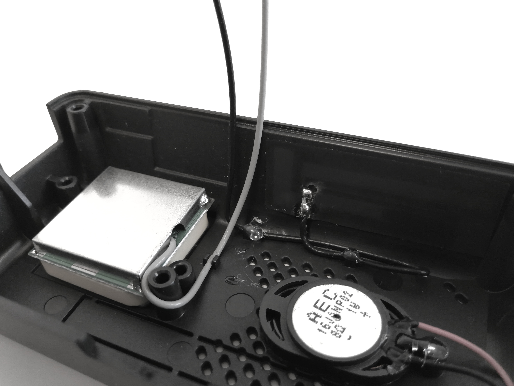

5. On the broad side of the top casing, there is this subtle square indent, and here is where you should cut if you want to access the mini HDMI port.  

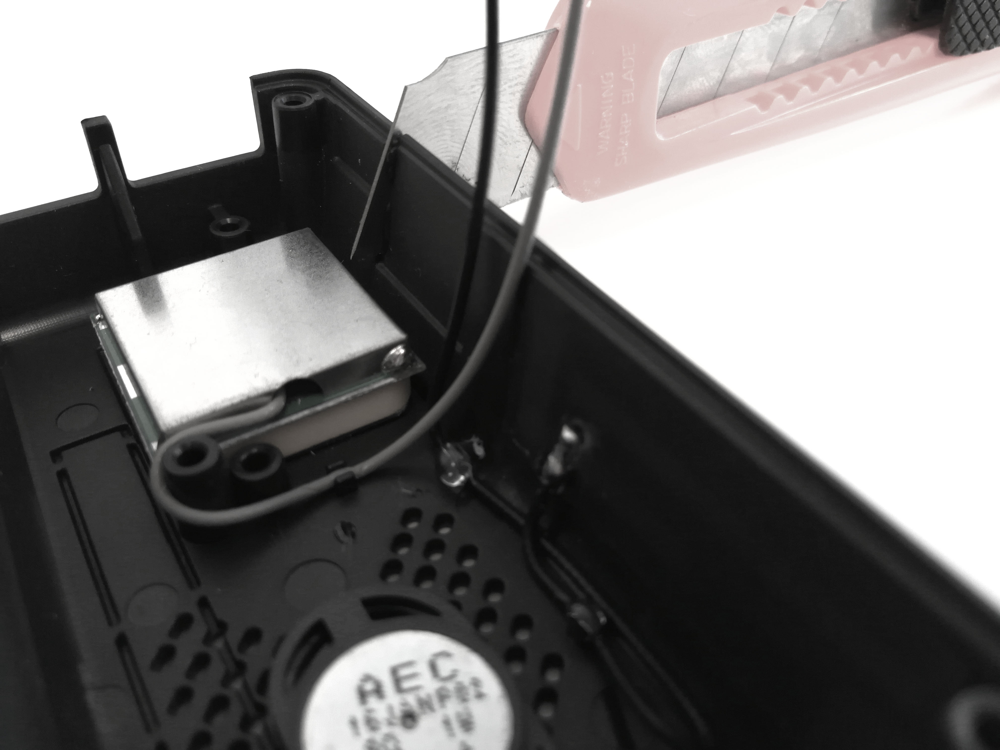
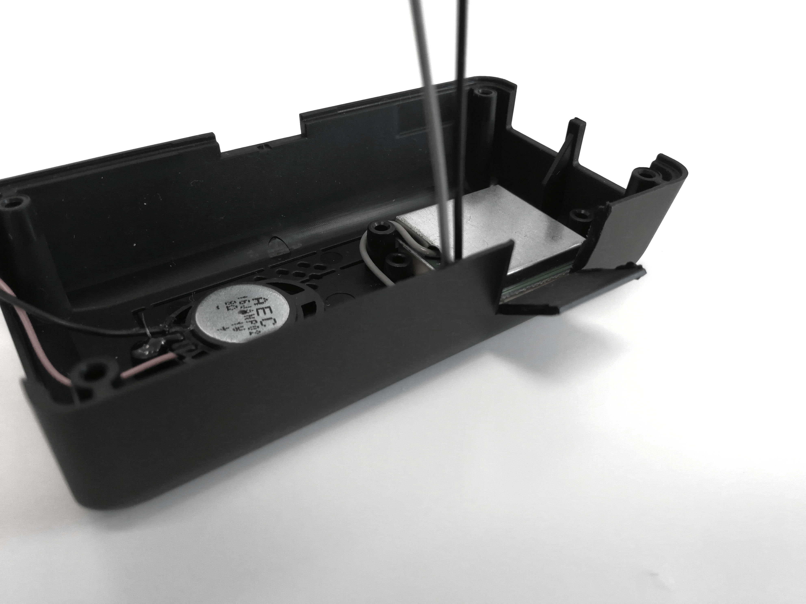
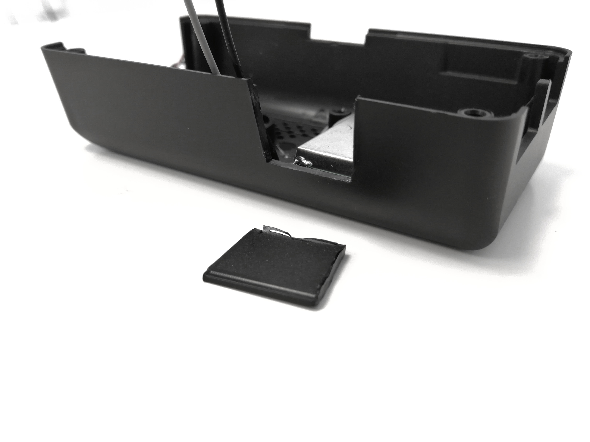

6. For the GPIO pins, there is a rectangular cutout marking on the top casing. This is where you should cut if you want to use it for the GPIO pins. 
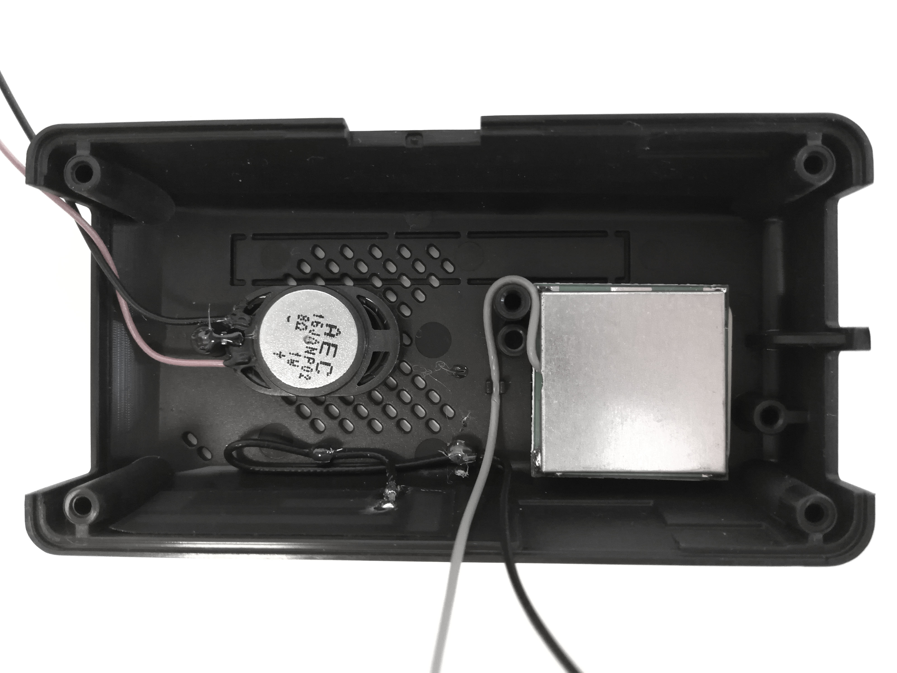
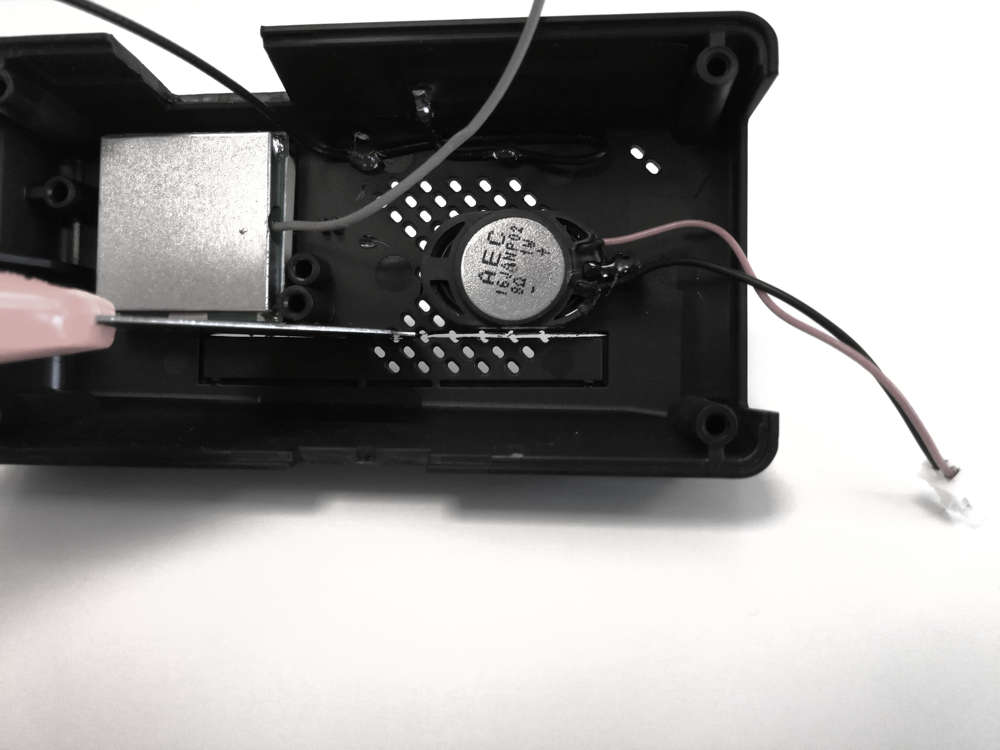
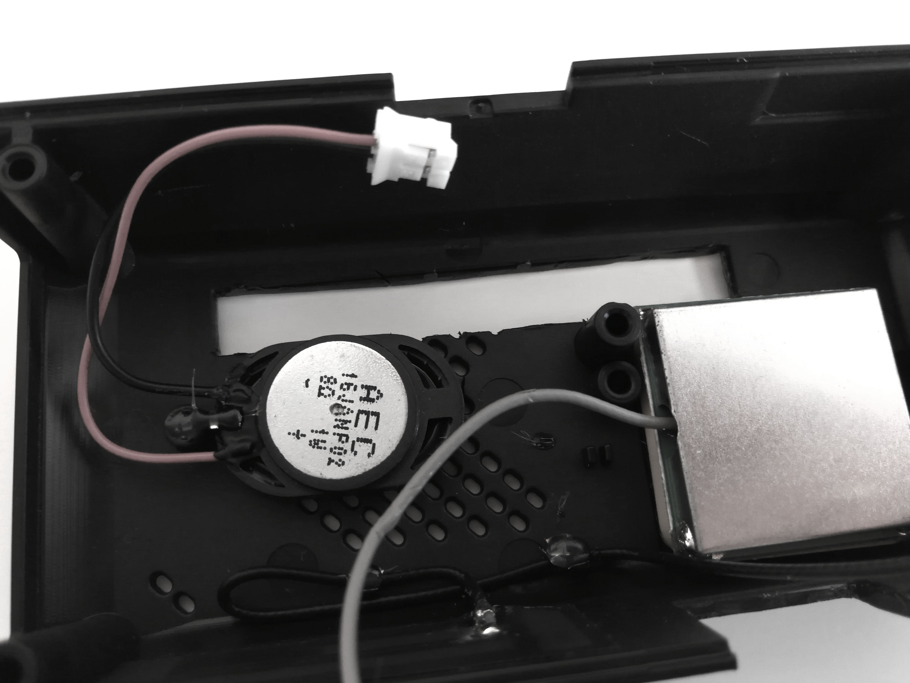

7. Remember to be methodical, careful and slow when cutting in order not to hurt yourself or do damage to the device. 

8. Congratulations, you can now access both the GPIO pins, and the mini HDMI port.

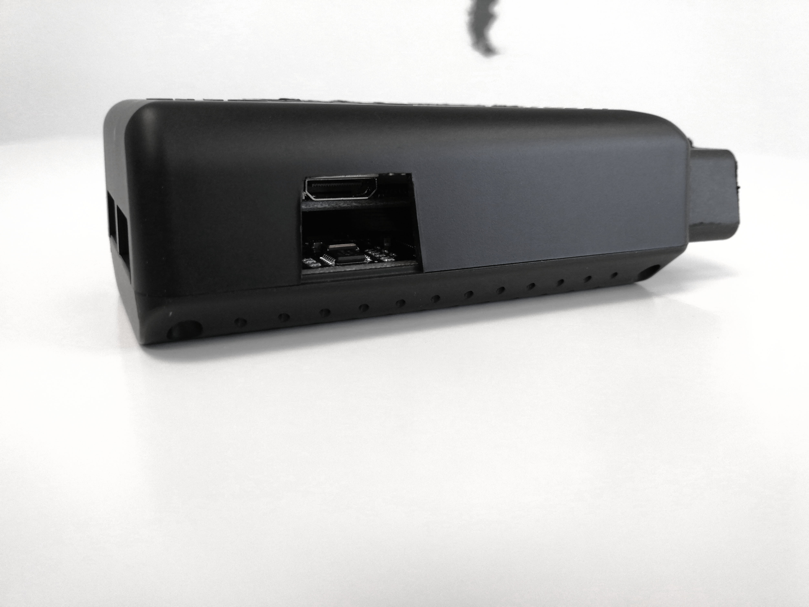
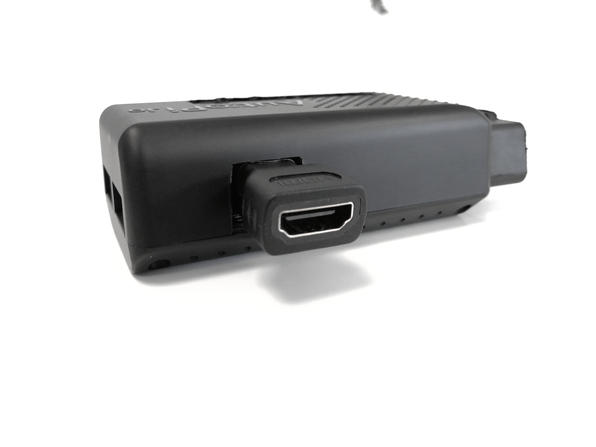
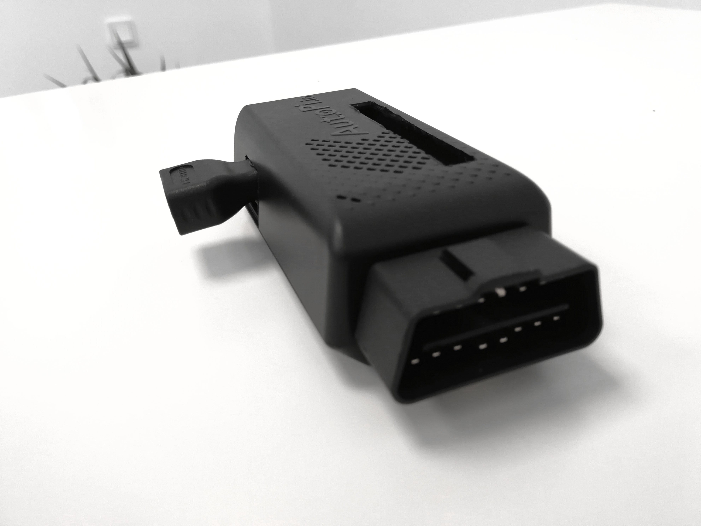

### Discussion

If you'd like to discuss this topic with us or other fellow community memebers, you can do so on our community page dedicated for this guide:
[Using the GPIO and HDMI Connector with the AutoPi Gen 2 casing](https://community.autopi.io/t/using-the-gpio-and-hdmi-connector-with-the-autopi-gen-2-casing/374)